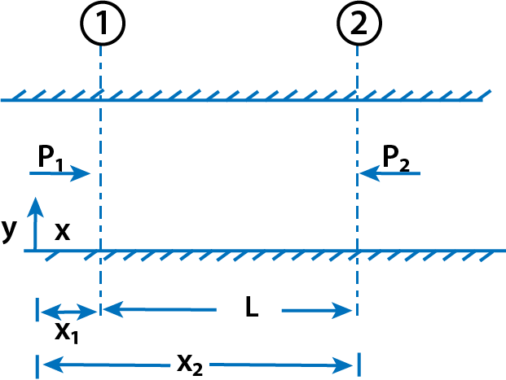

<h3>Flow of Viscous fluid between two parallel plates</h3>

In this case also, the shear stress distribution, the velocity distribution across a section; the ratio of maximum velocity to average velocity and difference of pressure head for a given length of parallel plates, are to be calculated.

$$ Fig\ 1.\ \ Viscous\ flow\ between\ two\ parallel\ plates  $$

Consider two parallel fixed plates kept at a distance 'h' apart as shown in Fig 1. A viscous fluid is flowing between these two plates from left to right. Consider a fluid element of length &#916;x and thickness &#916;y at a distance y from the lower fixed plate. If p is the intensity of pressure on the face AB of the fluid element then intensity of pressure on the face CD will be  
$$ (p + \frac{\partial p}{\partial x}\Delta x) $$
 
Let &#964; is the shear stress acting on the face BC then the shear stress on the face AD will be  
$$ (\tau + \frac{\partial τ}{\partial y}\Delta y) $$
If the width of the element in the direction perpendicular to the paper is unity then the forces acting on the fluid element are:

The pressure force, (p * &#916;y * 1) on face AB.

The pressure force,  $$ (p + \frac{\partial p}{\partial x}\Delta x * \Delta y * 1) $$ on face CD.

The shear force, &#964; * &#916;x * 1 on face BC. 

The shear force,  $$ (\tau + \frac{\partial \tau}{\partial y}\Delta y * \Delta x * 1) $$ on face AD.

For steady and uniform flow, there is no acceleration and hence the resultant force in the direction of flow is zero.

$$ \therefore p \Delta y * 1 - (p + \frac{\partial p}{\partial x}\Delta x)\Delta y * 1 - \tau \Delta x * 1 + (\tau + \frac{\partial \tau}{\partial y}\Delta y)\Delta x * 1 = 0 $$
or

$$ - \frac{\partial p}{\partial x}\Delta x \Delta y + \frac{\partial \tau}{\partial y}\Delta y \Delta x = 0 $$

Dividing by ΔxΔy, we get

$$ - \frac{\partial p}{\partial x} + \frac{\partial \tau}{\partial y} = 0 $$
or
$$ \frac{\partial p}{\partial x} = \frac{\partial \tau}{\partial y} ...(1) $$

<h3>Velocity Distribution</h3>

To obtain the velocity distribution across a section, the value of shear stress τ = μ(du/dy) from Newton's law of viscosity for laminar flow is substituted in equation (9.7).

$$ \frac{\partial p}{\partial x} = \frac{\partial}{\partial y}(\mu \frac{du}{dy}) = \mu \frac{d^2u}{dy^2} $$

$$ \frac{d^2u}{dy^2} = \frac{1}{\mu} \frac{\partial p}{\partial x} $$

Integrating the above equation w.r.t. y, we get

$$ \frac{du}{dy} = \frac{1}{\mu} \frac{\partial p}{\partial x} y + C_1 $$

  $$ \because \frac{\partial p}{\partial x} $$  is constant 

Integrating again

$$ u = \frac{1}{2\mu} \frac{\partial p}{\partial x} y^2 + C_1y + C_2 $$

where C1 and C2 are constants of integration. Their values are obtained from the two boundary conditions that is (i) at y = 0, u = 0 (ii) at y = t, u = 0.

The substitution of y = 0, u = 0 in equation (2) gives

$$ 0 = 0 + C_1 \times 0 + C_2 $$
or
$$ C_2 = 0 $$

The substitution of y = t, u = 0 in equation (2) gives

$$ 0 = \frac{1}{2\mu} \frac{\partial p}{\partial x} t^2 + C_1t + 0 $$

$$ C_1 = -\frac{1}{2\mu} \frac{\partial p}{\partial x} t $$

Substituting the values of C₁ and C₂ in equation (2)

$$ u = \frac{1}{2\mu} \frac{\partial p}{\partial x} y^2 + y(-\frac{1}{2\mu} \frac{\partial p}{\partial x} t) $$

$$ u = -\frac{1}{2\mu} \frac{\partial p}{\partial x} [ty - y^2] $$

or

$$ u = \frac{1}{2\mu} \frac{\partial p}{\partial x} [ty - y^2] ...(3) $$

In the above equation, &#956;, $$ \frac{\partial p}{\partial x} $$  and t are constant. It means u varies with the square of y. Hence equation (3) is a equation of a parabola. Hence velocity distribution across a section of the parallel plate is parabolic. This velocity distribution is shown in Fig 2 (a).

$$ Fig\ 2.\ \ Velocity\ distribution\ and\ shear\ stress\ distribution\ across\ a\ section\ of\ parallel\ plates  $$

<h3>Ratio of Maximum Velocity to Average Velocity</h3>

The velocity is maximum, when (y = t/2)

Substituting this value in equation (3), we get

$$ u_{max} = \frac{1}{2\mu} \frac{\partial p}{\partial x} \left[t \times \frac{t}{2} - \left(\frac{t}{2}\right)^2\right] $$

$$ = \frac{1}{2\mu} \frac{\partial p}{\partial x} \left[\frac{t^2}{2} - \frac{t^2}{4}\right] = \frac{1}{2\mu} \frac{\partial p}{\partial x} \frac{t^2}{4} = \frac{1}{8\mu} \frac{\partial p}{\partial x} t^2 \ \ \ \ \ \ ...(4) $$

The average velocity, $$ \bar{u} $$ , is obtained by dividing the discharge (Q) across the section by the area of the section (t * 1). And the discharge (Q) is obtained by considering the rate of flow of fluid through the strip of thickness dy and integrating it. The rate of flow through strip is

$$ dQ = \text{Velocity at a distance y} \times \text{Area of Strip} $$

$$ = - \frac{1}{2\mu} \frac{\partial p}{\partial x} [ty - y^2] \times dy \times 1 $$

$$ \therefore Q = \int_{0}^{t} dQ = \int_{0}^{t} \frac{1}{2\mu} \frac{\partial p}{\partial x} [ty - y^2] dy $$

$$ = - \frac{1}{2\mu} \frac{\partial p}{\partial x} \left[\frac{ty^2}{2} - \frac{y^3}{3}\right]_{0}^{t} = \frac{1}{2\mu} \frac{\partial p}{\partial x} \left[\frac{t^3}{2} - \frac{t^3}{3}\right] $$

$$ = - \frac{1}{2\mu} \frac{\partial p}{\partial x} \frac{t^3}{6} = - \frac{1}{12\mu} \frac{\partial p}{\partial x} t^3 $$

$$ \bar{u} = \frac{Q}{\text{Area}} = - \frac{\frac{1}{12\mu} \frac{\partial p}{\partial x} t^3}{t \times 1} = - \frac{1}{12\mu} \frac{\partial p}{\partial x} t^2 \ \ \ \ \ \  ...(5) $$

Dividing equation (4) by equation (5), we get

$$ \frac{U_{max}}{\bar{u}} = \frac{\frac{1}{8\mu} \frac{\partial p}{\partial x} t^2}{\frac{1}{12\mu} \frac{\partial p}{\partial x} t^2} = \frac{12}{8} = \frac{3}{2} \ \ \ \ \ \ ...(6) $$

<h3>Drop of Pressure head for a given Length</h3>

From equation (5), we have

$$ \bar{u} = -\frac{1}{12\mu} \frac{\partial p}{\partial x} t^2 $$

or

$$ \frac{\partial p}{\partial x} = -\frac{12\mu \bar{u}}{t^2} $$

Integrating this equation w.r.t. x, we get

$$ \int_{p_2}^{p_1} dp = \int_{x_2}^{x_1} -\frac{12\mu \bar{u}}{t^2} dx $$

$$ p_1 - p_2 = -\frac{12\mu \bar{u}}{t^2} [x_1 - x_2] = \frac{12\mu \bar{u}}{t^2} [x_2 - x_1] $$

or
$$ p_1 - p_2 = \frac{12\mu\bar{u}L}{t^2} $$
$$ \because x_1 - x_2 = L $$

If hf is the drop of pressure head, then

$$ h_f = \frac{p_1 - p_2}{\rho g} = \frac{12\mu\bar{u}L}{\rho gt^2} \ \ \ \ \ \ ...(10) $$

$$ Fig\ 3.  $$

<h3>Shear Stress Distribution</h3>

It is obtained by substituting the value of u from equation (3) into

$$ \tau = \mu \frac{du}{dy} $$

$$ \tau = \mu \frac{\partial}{\partial y}[-\frac{1}{2\mu} \frac{\partial p}{\partial x} (ty - y^2)] = \mu[-\frac{1}{2\mu} \frac{\partial p}{\partial x} (t - 2y)] $$

$$ \tau = -\frac{1}{2} \frac{\partial p}{\partial x} (t - 2y) \ \ \ \ \ \ ...(11) $$

In equation (11), $$ \frac{\partial p}{\partial x} $$  and t are constant. Hence &#964; varies linearly with y. The shear stress distribution is shown in Fig 2 (b). Shear stress is maximum, when y = 0 or t at the walls of the plates. Shear stress is zero, when y = t/2 that is at the centre line between the two plates. Max. shear stress (&#964;o) is given by

$$ \tau_0 = -\frac{1}{2} \frac{\partial p}{\partial x} t \ \ \ \ \ \ ...(12) $$